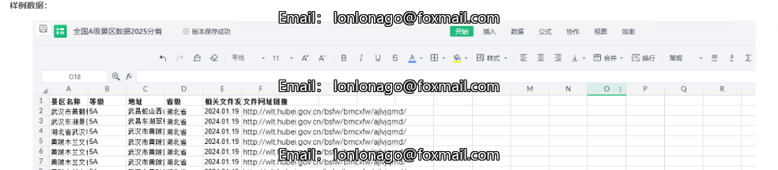
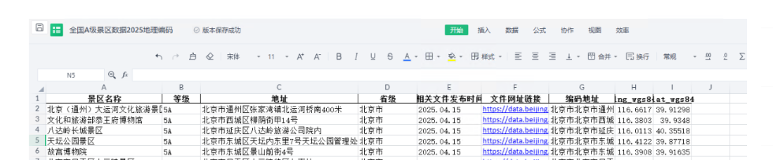

# National A-Level Scenic Spots Dataset.xlsx

Data Introduction: A-level scenic spots are categorized into different levels ranging from A to 5A, representing the national rating system for the quality of tourist attractions. The signs and certificates of quality level in tourist attractions are uniformly stipulated by the National Tourism Quality Rating Institution, with the assessment work for A-level to 3A-level scenic spots entrusted to the Provincial Tourism Quality Rating Commissions. For 4A-level scenic spots, the assessment is directly conducted by the National Scenic Area Quality Assessment Committee. Scenic spots that have obtained the qualification for 4A within a year and meet the application criteria can apply for the 5A rating. 5A-level scenic spots require recommendation from the Provincial Tourism Quality Rating Committee before being evaluated by the National Tourism Quality Rating Committee.
According to publicly available data from various provinces, this dataset organizes basic information about national A and up to 5A level scenic spots including their names, levels, provinces and cities/counties they belong to, coordinates, addresses, and assessment dates. It covers the latest data on A-level scenic spots from March 2025 across all 31 provinces.

Data Source: Public website (dataset includes specific URLs)
Time Range: Up to May 2025
Inclusion Metrics:
- Scenic spot name
- Level
- Address
- Province
- Relevant document release date
- File URL link
- Code address lng_wgs84 lat_wgs84

The dataset provides comprehensive information about A-level and above scenic spots nationwide, offering a valuable resource for researchers and tourism professionals interested in the quality standards and geographical locations of these popular destinations.

## Images

Here is a pay link on Stripe ( https://buy.stripe.com/3cs8yP7sY87d0vu9AB ). Please contact me lonlonago@foxmail.com after funding $89, and I will send you a complete data files , thank you!

